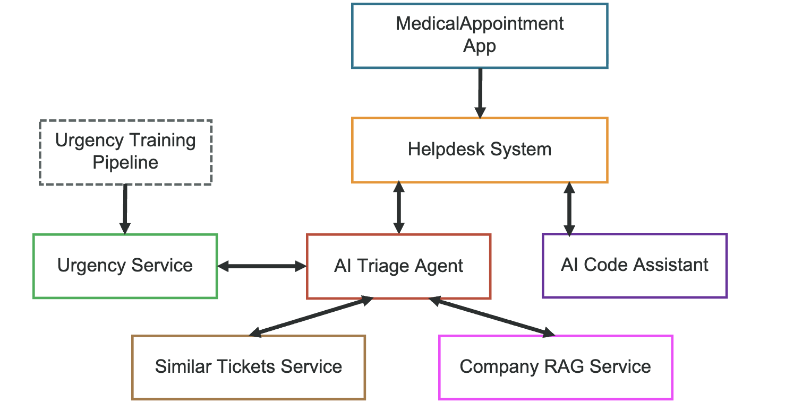
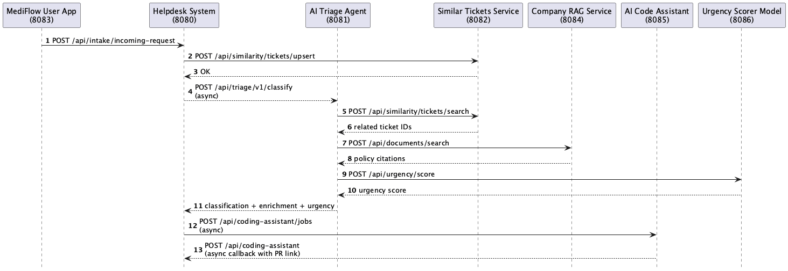

# AI-Powered Helpdesk System for MedicalAppointment App

MedicalAppointment is a demonstration platform consisting of multiple microservices that together form an AI-powered helpdesk system for a regular medical appointment app. Patients manage appointments and submit support requests through a web app. Those requests flow into a centralized helpdesk that uses AI triage, semantic similarity search, and company-policy document retrieval to classify, prioritize, and route tickets, as well as a coding assistant to automatically fix reported bugs.

## Architecture Overview



### Request Flow




1. A patient submits a help request in the **user-facing web app** (:8083).
2. The request arrives at the **helpdesk** (:8080) as an incoming ticket.
3. Helpdesk calls the **AI triage** service (:8081) to classify and route the ticket with an AI confidence score. 
4. If *AI triage** responds with a confidence below **0.4**, the request is returned to the human review/dispatch queue.
5. AI triage enriches the result by additionally calling:
   - **Urgency service** (:8086) generates a priority score from a domain-trained machine learning model (built in Java with DeepNetts).
   - **Similar-tickets** service (:8082) performs vector search over historical tickets.
   - **Company-documents RAG** service (:8084) checks for policy/knowledge-base citations with RBAC
6. As AI triage returns classification (ticket type), urgency, confidence, and enrichments to helpdesk, this service further dispatches the ticket to a mapped team.
Tickets with urgency score >= 0.8 are considered critical and are escalated to an on-call employee.
7. If a ticket type is triaged as a bug, a job request is initiated to the coding assistant that can propose a PR to fix it.

> For detailed diagrams (Mermaid + PlantUML) see [docs/SYSTEM_DIAGRAM.md](docs/SYSTEM_DIAGRAM.md).  
> For full architecture notes and quick-start order see [docs/ARCHITECTURE.md](docs/ARCHITECTURE.md).
> For a canonical local runtime port map (services, DBs, MCP variants), see [PORTS.md](PORTS.md).

## Services

| Service                                                         | Port | Description                                                                           |
|-----------------------------------------------------------------|------|---------------------------------------------------------------------------------------|
| [medicapt-user-facing](services/medicapt-user-facing/)          | 8083 | Patient-facing web app for appointments, billing, support requests                    |
| [helpdesk](services/helpdesk/)                                  | 8080 | System-of-record ticketing, dispatch, RBAC, ticket lifecycle                          |
| [ai-triage](services/ai-triage/)                                | 8081 | LLM-powered classification, proxy for urgency scoring and enrichment                  |
| [similar-tickets](services/similar-tickets/)                    | 8082 | Vector-similarity search over historical tickets (Oracle AI + OpenAI embeddings)      |
| [company-rag](services/company-rag/)                            | 8084 | Company-document RAG with RBAC-controlled citations (Oracle AI + OpenAI embeddings)   |
| [coding-assistant](services/coding-assistant/)                  | 8085 | Async bug-fix assistant that prepares PRs and callbacks to helpdesk                   |
| [urgency](services/urgency)                                     | 8086 | A service that generates urgency score from a domain-trained ML model.                |
| [urgency-mcp](services/urgency-mcp)                             | 8086 | An alternative MCP service to calculate urgency score from a domain-trained ML model. |
| [urgency-training-pipeline](services/urgency-training-pipeline) | -    | The component responsible for training the domain specific ML model.                  |


Each service is independently deployable with its own `pom.xml`, `README.md`, and `CONTRACTS.md`.

## Quick Start

**Prerequisites:** Java 25+, Maven 3.8+, Docker.

For OpenAI-backed services, configure API key via either:
- `services/similar-tickets/config/config-prod.yaml` (`openai.api-key`)
- `OPENAI_API_KEY` environment variable

Preferred startup:

```bash
./start-all.sh
```

By default, UI event/activity log side panels are hidden. To show them and follow ticket paths throughout the services:

```bash
./start-all.sh -show-event-log
```

Set one zoom level for all service dashboards from startup:

```bash
./start-all.sh -ui-zoom=120
```

Both options can be combined:

```bash
./start-all.sh -show-event-log -ui-zoom=120
```

Run all tests across all services:

```bash
./run-all-tests.sh
```

`run-all-tests.sh` executes `mvn test` per service (unit-test scope). By default this does **not** run paid vectorization/API workflows. In particular, `similar-tickets` integration-style tests that need real OpenAI/Oracle are skipped unless explicit system properties are provided.

> [!WARNING]
> If `OPENAI_API_KEY` is set and you run the default `./start-all.sh`, demo loaders for similar-tickets and company-rag will run and trigger embedding/vectorization calls.
> Roughly, that is about **20k tokens total** on startup or approx. **$0.0026 USD** per startup with current embedding model settings.
> If you want to start without demo vectorization costs, run:
>
> ```bash
> HELPDESK_DEMO_DATA=false COMPANY_RAG_DEMO_DATA=false SIMILAR_TICKETS_DEMO_DATA=false ./start-all.sh
> ```

`start-all.sh` supports demo-data toggles via environment variables:

```bash
# Defaults (all true):
# HELPDESK_DEMO_DATA=true
# COMPANY_RAG_DEMO_DATA=true
# SIMILAR_TICKETS_DEMO_DATA=true

# Example: disable similar-tickets demo preload
SIMILAR_TICKETS_DEMO_DATA=false ./start-all.sh

# Example: disable all demo loading
HELPDESK_DEMO_DATA=false COMPANY_RAG_DEMO_DATA=false SIMILAR_TICKETS_DEMO_DATA=false ./start-all.sh
```

Manual startup order for development:

Ensure `OPENAI_API_KEY` is set in your environment variables before starting services that use embeddings/models.

```bash
# 0. Start the auxiliary services
docker compose up

# 1. User-facing app
cd services/medicapt-user-facing && mvn quarkus:dev

# 2. Helpdesk (needs MySQL connection)
cd services/helpdesk && mvn quarkus:dev

# 3. AI triage
cd services/ai-triage && mvn quarkus:dev

# 4. Similar-tickets (needs Oracle AI connection)
cd services/similar-tickets
mvn clean verify
java -DDemoData=true -jar target/similarity.jar

# 5. Company-documents RAG (needs Oracle AI connection)
cd services/company-rag && mvn quarkus:dev -Ddemo.data.load=true

# 6. Headless coding assistant
cd services/coding-assistant && mvn quarkus:dev
```

See each service's README for full setup details.

## Repository Structure

```
j1-ai-demo/
├── services/
│   ├── medicapt-user-facing/      # :8083  Patient web app
│   ├── helpdesk/                  # :8080  Ticketing system
│   ├── ai-triage/                 # :8081  AI classification
│   ├── similar-tickets/           # :8082  Ticket similarity
│   ├── company-rag/               # :8084  Document RAG
│   └── coding-assistant/          # :8085  Async bug-fix PR assistant
│   └── coding-assistant/          # :8086  Urgency score service
docs/
├── ARCHITECTURE.md   # Architecture overview & quick-start guide
├── human-workflow-components.png
├── human-workflow-components.puml
├── sequence-diagram.png
├── sequence-diagram.puml
├── system-components.png
└── system-components.puml
└── README.md
```


## Tech Stack

| Service                   | Framework                   | AI / DB                            |
|---------------------------|-----------------------------|------------------------------------|
| medicapt-user-facing      | Quarkus + Qute              | — / in-memory                      |
| helpdesk                  | Quarkus + Hibernate/Panache | — / MySQL                          |
| ai-triage                 | Quarkus + LangChain4j       | GPT-4o-mini / —                    |
| similar-tickets           | Helidon + LangChain4j       | OpenAI embeddings / Oracle AI 26ai |
| company-rag               | Quarkus + LangChain4j       | OpenAI embeddings / Oracle AI 26ai |
| coding-assistant          | Quarkus                     | OpenAI Codex / GitHub CLI          |
| urgency                   | Quarkus                     | -                                  |
| urgency-mcp               | Helidon                     | -                                  |
| urgency-training-pipeline |                             | DeepNetts, DJL                     |


## Demo Notice

This is a demonstration system. Services use simplified data, have no real authentication, and simulate certain integrations. See each service's README for specific limitations.
