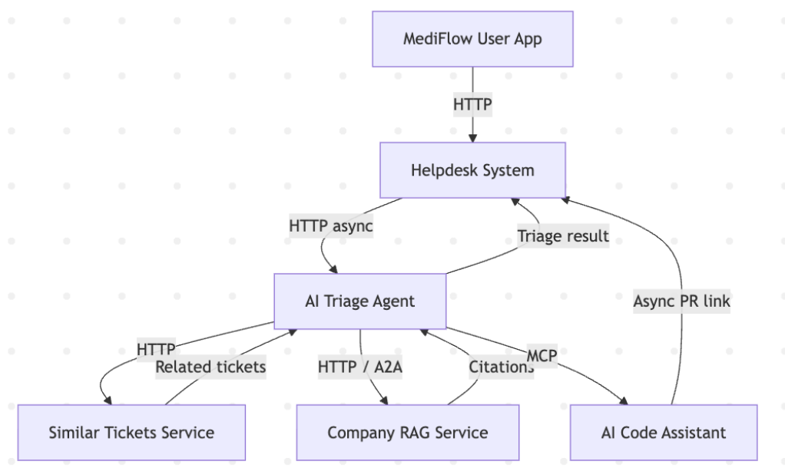
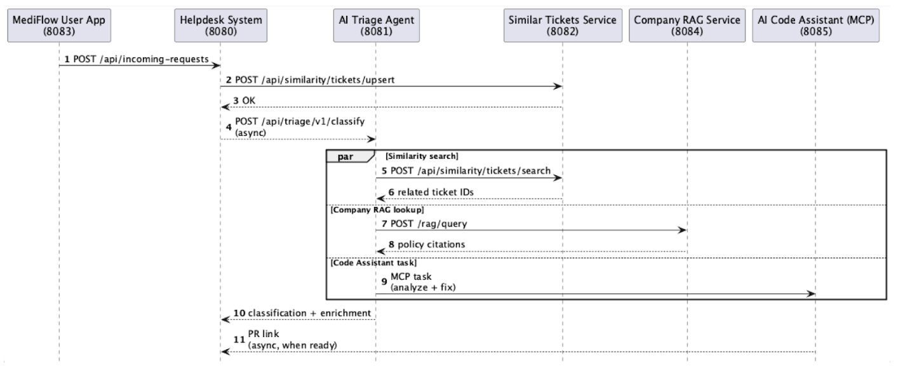

# MediFlow - AI-Powered Medical Support System

MediFlow is a demonstration platform consisting of multiple microservices that together form an AI-powered medical appointment and helpdesk system. Patients manage appointments and submit support requests through a web app; those requests flow into a centralized helpdesk that uses AI triage, semantic similarity search, and company-policy document retrieval to classify, prioritise, and route tickets.

## System Architecture



### Request Flow





1. Patient submits a help request via the **user-facing web app** (:8083)
2. Request arrives at the **helpdesk** (:8080) as an incoming request
3. Helpdesk asynchronously calls the **AI triage** service (:8081) to classify the ticket
4. AI triage enriches the classification in parallel:
   - **Similar-tickets** service (:8082) — vector search over historical tickets
   - **Company-documents RAG** service (:8084) — policy/knowledge-base citations with RBAC
5. Classified ticket (type, urgency, confidence, related tickets, policy docs) returns to the helpdesk
6. Helpdesk assigns the ticket to the appropriate team based on ticket type

> For detailed diagrams (Mermaid + PlantUML) see [docs/SYSTEM_DIAGRAM.md](docs/SYSTEM_DIAGRAM.md).  
> For full architecture notes and quick-start order see [docs/ARCHITECTURE.md](docs/ARCHITECTURE.md).

## Services

| Service | Port | Description |
|---------|------|-------------|
| [mediflow-user-facing](services/mediflow-user-facing/) | 8083 | Patient-facing web app for appointments, billing, support requests |
| [mediflow-helpdesk](services/mediflow-helpdesk/) | 8080 | System-of-record ticketing, dispatch, RBAC, ticket lifecycle |
| [mediflow-ai-triage](services/mediflow-ai-triage/) | 8081 | LLM-powered classification, urgency scoring, enrichment |
| [mediflow-similar-tickets](services/mediflow-similar-tickets/) | 8082 | Vector-similarity search over historical tickets (Oracle AI + OpenAI embeddings) |
| [mediflow-company-rag](services/mediflow-company-rag/) | 8084 | Company-document RAG with RBAC-controlled citations (Qdrant + OpenAI embeddings) |

Each service is independently deployable with its own `pom.xml`, `README.md`, and `CONTRACTS.md`.

## Quick Start

**Prerequisites:** Java 17+, Maven 3.8+, Docker, `OPENAI_API_KEY` env var.

Start services in this order:

```bash
# 1. User-facing app
cd services/mediflow-user-facing && mvn quarkus:dev

# 2. Helpdesk (needs MySQL via Docker)
cd services/mediflow-helpdesk && docker-compose up -d && ./mvnw quarkus:dev -DDemoData=true

# 3. AI triage
cd services/mediflow-ai-triage && mvn quarkus:dev

# 4. Similar-tickets (needs Oracle AI via Docker)
cd services/mediflow-similar-tickets && docker-compose up -d && mvn clean verify && java -jar target/similar-tickets.jar

# 5. Company-documents RAG (needs Qdrant via Docker)
cd services/mediflow-company-rag && docker-compose up -d && mvn quarkus:dev -DDemoData=true
```

See each service's README for full setup details.

## Repository Structure

```
j1-ai-demo/
├── services/
│   ├── mediflow-user-facing/      # :8083  Patient web app
│   ├── mediflow-helpdesk/         # :8080  Ticketing system
│   ├── mediflow-ai-triage/        # :8081  AI classification
│   ├── mediflow-similar-tickets/  # :8082  Ticket similarity
│   └── mediflow-company-rag/      # :8084  Document RAG
├── docs/
│   ├── ARCHITECTURE.md            # Full architecture & quick-start guide
│   ├── SYSTEM_DIAGRAM.md          # Mermaid + PlantUML diagrams
│   ├── system_components.png
│   └── sequence_diagram.png
└── README.md
```


## Tech Stack

| Service | Framework | AI / DB |
|---------|-----------|---------|
| mediflow-user-facing | Quarkus + Qute | — / in-memory |
| mediflow-helpdesk | Quarkus + Hibernate/Panache | — / MySQL |
| mediflow-ai-triage | Quarkus + LangChain4j | GPT-4o-mini / — |
| mediflow-similar-tickets | Helidon + LangChain4j | OpenAI embeddings / Oracle AI |
| mediflow-company-rag | Quarkus + LangChain4j | OpenAI embeddings / Qdrant |

## Demo Notice

This is a demonstration system. Services use simplified data, have no real authentication, and simulate certain integrations. See each service's README for specific limitations.
