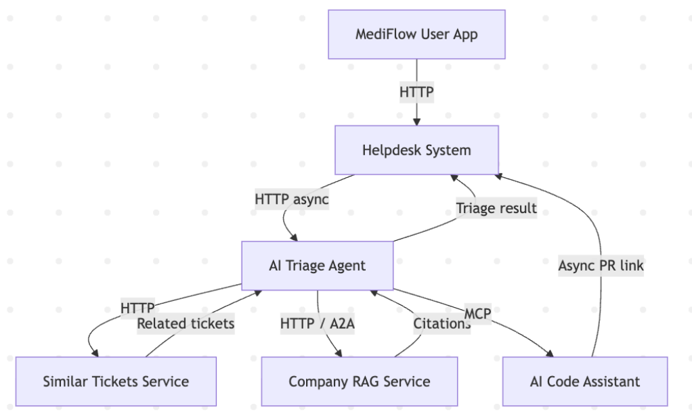
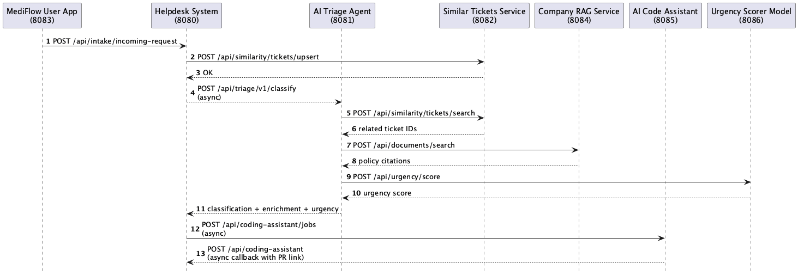

# MedicalAppointment: AI-Assisted Helpdesk Demo Architecture

This repository documents the architecture of the **MedicalAppointment AI-assisted helpdesk demo**.  
The system demonstrates how user support requests flow from a user-facing app through AI triage, similarity search, and internal knowledge retrieval into a centralized helpdesk.

---

## Table of Contents
- [System Overview](#system-overview)
- [Quick Start (Demo)](#quick-start-demo)
- [Repo: MedicalAppointment User-Facing App](#repo-medicalappointment-user-facing-app)
- [Repo: MedicalAppointment Helpdesk](#repo-medicalappointment-helpdesk)
- [Repo: AI Triage Service](#repo-ai-triage-service)
- [Repo: Ticket Similarity Service](#repo-ticket-similarity-service)
- [Repo: Company Documents RAG Service](#repo-company-documents-rag-service)

---

## System Overview





---

## Quick Start (Demo)

### Required Environment
OCI GenAI is the default model provider for AI triage, ticket embeddings, and document embeddings. Configure OCI API key auth in `~/.oci/config` and set `OCI_COMPARTMENT_ID`. Ticket and document embeddings default to `OCI_GENAI_REGION=us-chicago-1` for the default OCI embedding model.

OpenAI-compatible providers remain available by setting the relevant `*_PROVIDER=openai` environment variable and exporting `OPENAI_API_KEY`.

### Start Order

1. [medicapt-user-facing](../services/medicapt-user-facing/)  
   ```bash
   mvn quarkus:dev
   ```

2. [helpdesk](../services/helpdesk/)  
   ```bash
   docker-compose up -d
   mvn quarkus:dev
   ```

3. [ai-triage](../services/ai-triage/)  
   ```bash
   mvn quarkus:dev
   ```

4. [similar-tickets](../services/similar-tickets/)  
   ```bash
   docker-compose up -d
   mvn clean verify && java -jar target/similarity.jar
   ```

5. [company-rag](../services/company-rag/)  
   ```bash
   docker-compose up -d
   mvn quarkus:dev -Ddemo.data.load=true
   ```
---

<a id="repo-medicalappointment-user-facing-app"></a>
## Repo: MedicalAppointment User-Facing App
Purpose  
Simulated medical scheduling application where users book appointments and submit help requests.

Path: [services/medicapt-user-facing](../services/medicapt-user-facing/)

UI : http://localhost:8083

Startup  
`mvn quarkus:dev`

---

<a id="repo-medicalappointment-helpdesk"></a>
## Repo: MedicalAppointment Helpdesk

Purpose  
System of record for all tickets. Handles dispatching, lifecycle management, AI-created tickets, and RBAC-controlled document visibility.

Path: [services/helpdesk](../services/helpdesk/)

UI : http://localhost:8080

Startup  
`docker-compose up -d`  
`mvn quarkus:dev -DDemoData=true` (or `mvn quarkus:dev -DKeepData=true`)

---

<a id="repo-ai-triage-service"></a>
## Repo: AI Triage Service

Purpose  
Classifies incoming requests using an LLM, assigns urgency, finds related tickets, and retrieves policy citations.

Path: [services/ai-triage](../services/ai-triage/)

UI : http://localhost:8081

Startup  
`mvn quarkus:dev`

---

<a id="repo-ticket-similarity-service"></a>
## Repo: Ticket Similarity Service

Purpose  
Stores ticket embeddings and returns similar historical tickets using vector search.

Path: [services/similar-tickets](../services/similar-tickets/)

UI: http://localhost:8082

Startup  
```bash
docker-compose up -d
mvn clean verify && java -jar target/similarity.jar
```

---

<a id="repo-company-documents-rag-service"></a>
## Repo: Company Documents RAG Service

Purpose  
Stores internal company documents and returns relevant policy citations with RBAC controls.

Path: [services/company-rag](../services/company-rag/)

UI: http://localhost:8084

Startup  
```bash
docker-compose up -d
mvn quarkus:dev -Ddemo.data.load=true
```
