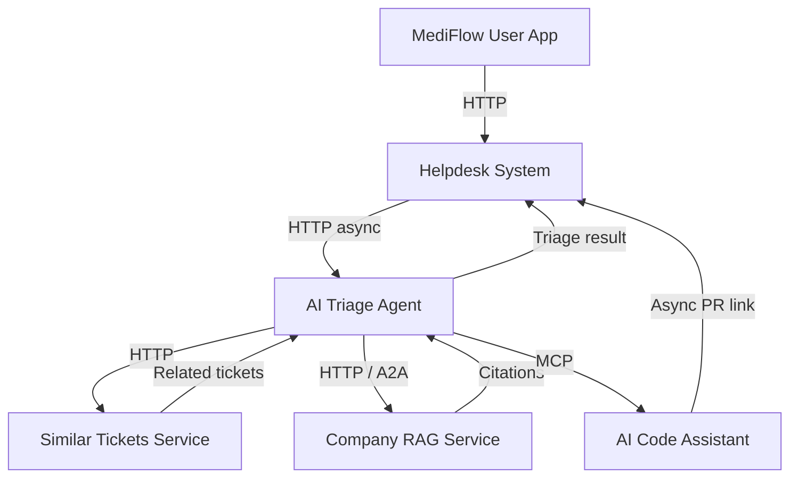
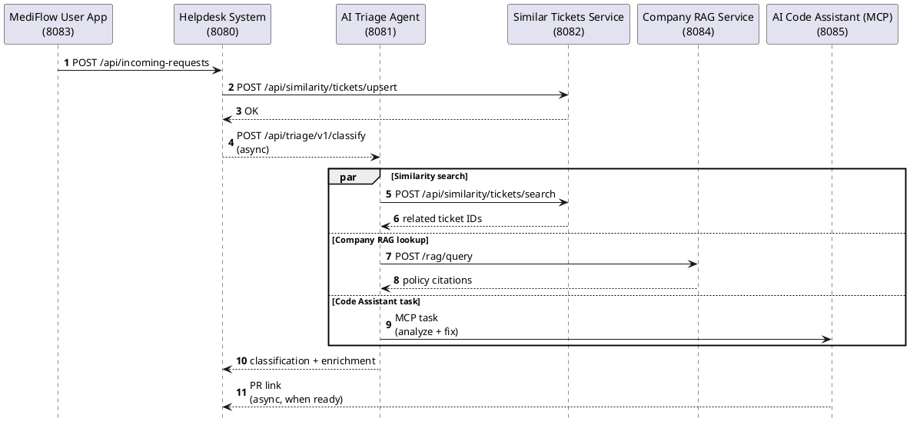

# High level System Context Diagram

```mermaid
flowchart TD
    MediFlow["MediFlow User App"]
    Helpdesk["Helpdesk System"]

    AITriage["AI Triage Agent"]
    Similarity["Similar Tickets Service"]
    RAG["Company RAG Service"]
    CodeAI["AI Code Assistant"]

    MediFlow -->|HTTP| Helpdesk

    Helpdesk -->|HTTP async| AITriage
    AITriage -->|Triage result| Helpdesk

    AITriage -->|HTTP| Similarity
    Similarity -->|Related tickets| AITriage

    AITriage -->|HTTP / A2A| RAG
    RAG -->|Citations| AITriage

    AITriage -->|MCP| CodeAI
    CodeAI -->|Async PR link| Helpdesk
```
# Flow Sequence Diagram

```puml
@startuml
hide footbox
autonumber

participant "MediFlow User App\n(8083)" as MediFlow
participant "Helpdesk System\n(8080)" as Helpdesk
participant "AI Triage Agent\n(8081)" as AITriage
participant "Similar Tickets Service\n(8082)" as Similarity
participant "Company RAG Service\n(8084)" as RAG
participant "AI Code Assistant (MCP)\n(8085)" as CodeAI

MediFlow -> Helpdesk : POST /api/incoming-requests

Helpdesk -> Similarity : POST /api/similarity/tickets/upsert
Similarity --> Helpdesk : OK

Helpdesk --> AITriage : POST /api/triage/v1/classify\n(async)

par Similarity search
  AITriage -> Similarity : POST /api/similarity/tickets/search
  Similarity --> AITriage : related ticket IDs
else Company RAG lookup
  AITriage -> RAG : POST /rag/query
  RAG --> AITriage : policy citations
else Code Assistant task
  AITriage -> CodeAI : MCP task\n(analyze + fix)
end

AITriage --> Helpdesk : classification + enrichment

CodeAI --> Helpdesk : PR link\n(async, when ready)
@enduml
```